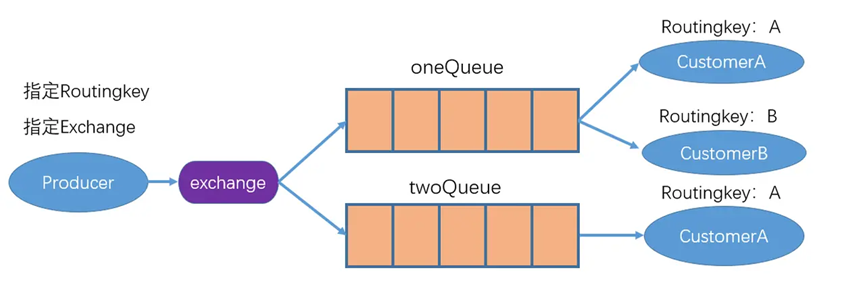

# 路由（routing）模式
&nbsp;&nbsp;&nbsp;&nbsp;&nbsp;&nbsp;&nbsp;&nbsp;前面几种模式，消息的目标队列无法由生产者指定，而在路由模式下，消息的目标队列，可以由生产者指定，其示意图如下所示：   
   
* 路由模式下Exchange的type为direct。
* 消息的目标队列可以由生产者按照routingKey规则指定。
* 费者通过BindingKey绑定自己所关心的队列。
* 一条消息队可以被多个消息者获取。
* 只有RoutingKey与BidingKey相匹配的队列才会收到消息。
 
