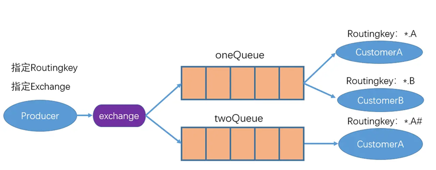

# 主题（topic）模式
&nbsp;&nbsp;&nbsp;&nbsp;&nbsp;&nbsp;&nbsp;&nbsp;主题模式是在路由模式的基础上，将路由键和某模式进行匹配。其中#表示匹配多个词，*表示匹配一个词，消费者可以通过某种模式的BindKey来达到订阅某个主题消息的目的，如示意图如下所示：

* 主题模式Exchange的type取值为topic。
* 一条消息可以被多个消费者获取。

