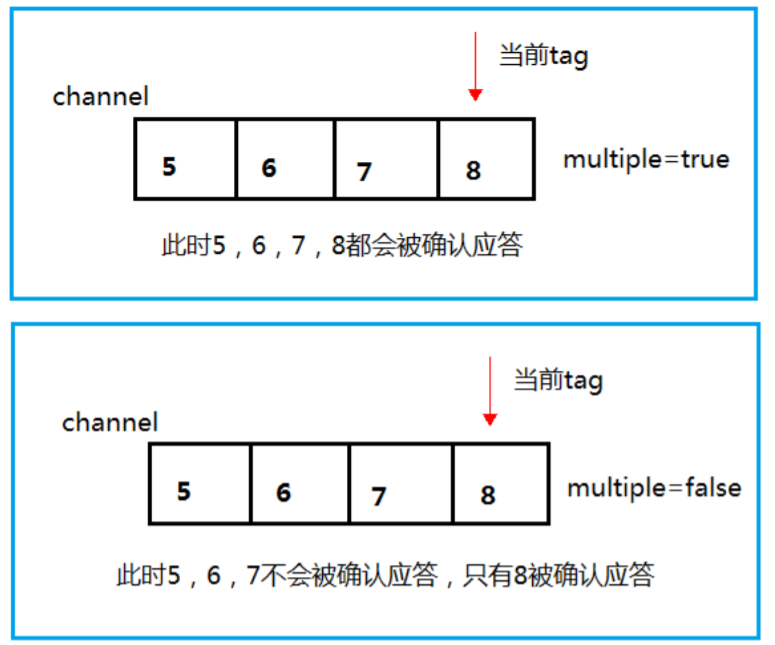

# 消息应答
&nbsp;&nbsp;&nbsp;&nbsp;&nbsp;&nbsp;&nbsp;&nbsp;RabbitMQ一旦向消费者传递了一条消息，便立即将该消息标记为删除。在这种情况下，突然有个消费者挂掉了，我们将丢失正在处理的消息，以及后续发送给该消费者的消息。     
&nbsp;&nbsp;&nbsp;&nbsp;&nbsp;&nbsp;&nbsp;&nbsp;为了保证消息在发送过程中不丢失，rabbitmq引入消息应答机制，消息应答就是：消费者在接收到消息并且处理该消息之后，告诉rabbitmq它已经处理了，rabbitmq可以把该消息删除了。   
## 自动应答
&nbsp;&nbsp;&nbsp;&nbsp;&nbsp;&nbsp;&nbsp;&nbsp;消息发送后立即被认为已经传送成功，这种模式需要在高吞吐量和数据传输安全性方面做权衡,因为这种模式如果消息在接收到之前，消费者那边出现连接或者 channel 关闭，那么消息就丢失了,当然另一方面这种模式消费者那边可以传递过载的消息，没有对传递的消息数量进行限制，当然这样有可能使得消费者这边由于接收太多还来不及处理的消息，导致这些消息的积压，最终使得内存耗尽，最终这些消费者线程被操作系统杀死，所以这种模式仅适用在消费者可以高效并以某种速率能够处理这些消息的情况下使用。   
## 手动应答（推荐使用）
### 手动应答的方法
* channel.basicAck(用于肯定确认)RabbitMQ 已知道该消息并且成功的处理消息，可以将其丢弃了。
* channel.basicNack(用于否定确认)。  
* channel.basicReject(用于否定确认)。与channel.basicNack 相比少一个(Multiple 批量处理)参数,不处理该消息了直接拒绝，可以将其丢弃了。   
### Multiple 的解释
multiple 的 true 和 false 代表不同意思。   
* true：代表批量应答 channel 上未应答的消息比如说 channel 上有传送 tag 的消息 5,6,7,8 当前 tag 是 8 ,那么此时5-8 的这些还未应答的消息都会被确认收到消息应答。  
* false：同上面相比只会应答 tag=8 的消息 5,6,7 这三个消息依然不会被确认收到消息应答。   
   
### 消息重新入队  
&nbsp;&nbsp;&nbsp;&nbsp;&nbsp;&nbsp;&nbsp;&nbsp;如果消费者由于某些原因失去连接(其通道已关闭，连接已关闭或 TCP 连接丢失)，导致消息未发送 ACK 确认，RabbitMQ 将了解到消息未完全处理，并将对其重新排队。如果此时其他消费者可以处理，它将很快将其重新分发给另一个消费者。这样，即使某个消费者偶尔死亡，也可以确保不会丢失任何消息。    
   

