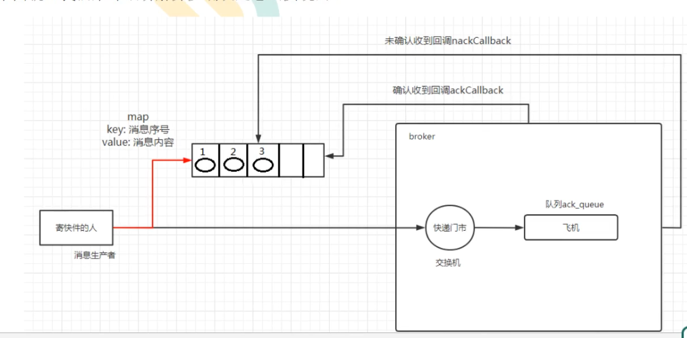

# 发布确认
## 原理
&nbsp;&nbsp;&nbsp;&nbsp;&nbsp;&nbsp;&nbsp;&nbsp;在队列持久化以及消息持久化的基础上，通过在生产者端进行发布确认，从而更加严格地保证消息不丢失。   
&nbsp;&nbsp;&nbsp;&nbsp;&nbsp;&nbsp;&nbsp;&nbsp;具体地，一旦信道进入confirm模式，所有在该信道上面发布地消息都将会被指派一个唯一地ID，一旦消息被投递到所有匹配的队列后，borker将会发送一个确认给生产者（包含唯一的ID），那么确认消息会在将消息写入磁盘之后发出，broker回传给生产者的确认消息中delivery-tag域包含了确认消息的序列号，此外broker也可可以设置basic.ack的multiple域，表示到这个序列号之前的所有消息都已经得到了处理。   
&nbsp;&nbsp;&nbsp;&nbsp;&nbsp;&nbsp;&nbsp;&nbsp;confirm模式最大的好处就是异步，一旦发布一条消息，生产者应用程序就可以在等信道返回确认的同时继续发送下一条消息，当消息最终得到确认之后，生产者应用便可以通过回调方法来处理该确认消息。如果Rabbit MQ因为自身内部错误导致消息丢失，就会发送一条nack消息，生产者应用程序同样可以在回调方法中处理该nack消息。  
## 发布确认的策略
### 单个确认发布
&nbsp;&nbsp;&nbsp;&nbsp;&nbsp;&nbsp;&nbsp;&nbsp;使用<b>同步</b>方式进行发布确认。具体地，发布一个确认一个。   
&nbsp;&nbsp;&nbsp;&nbsp;&nbsp;&nbsp;&nbsp;&nbsp;这种发布方式一个最大的缺点就是：发布速度特别的慢。因为如果没有发布确认的消息就会阻塞所有后续消息的发布，这种方式最多提供每秒不超过数百条发布消息的吞吐量。当然对于某些应用程序来说这可能已经足够了。
### 批量确认发布
&nbsp;&nbsp;&nbsp;&nbsp;&nbsp;&nbsp;&nbsp;&nbsp;单个确认发布方式非常慢，与单个等待确认消息相比，批量确认发布采用的策略为：先发布一批消息然后一起确认可以极大地提高吞吐量。当然这种方式的缺点就是：当发生故障导致发布出现问题时，不知道是哪个消息出现问题了，我们必须将整个批处理保存在内存中，以记录重要的信息而后重新发布消息。当然这种方案仍然是同步的，也一样阻塞消息的发布。
### 异步确认发布
&nbsp;&nbsp;&nbsp;&nbsp;&nbsp;&nbsp;&nbsp;&nbsp;不再采用同步确认，最复杂也是效率最高的策略。  
   

